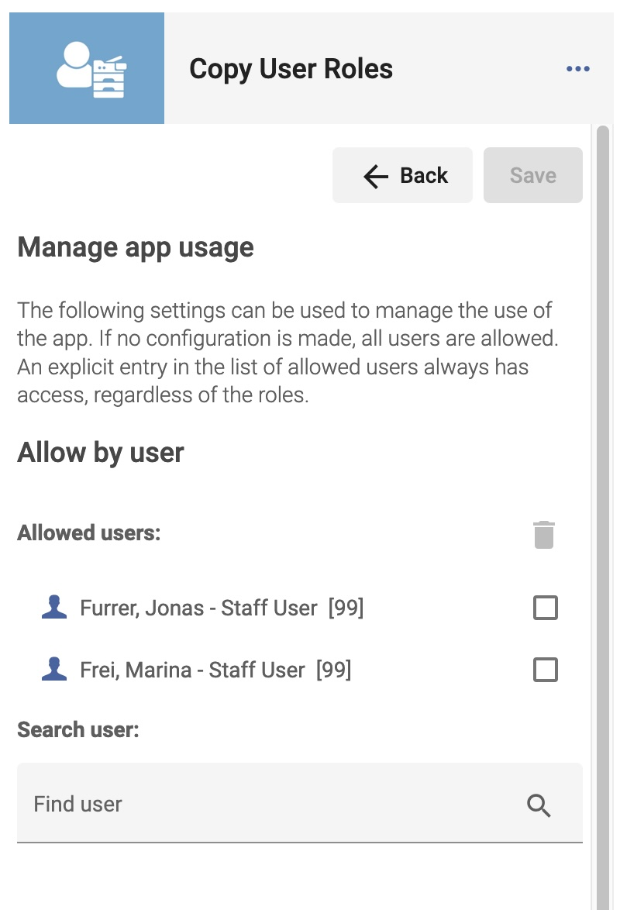
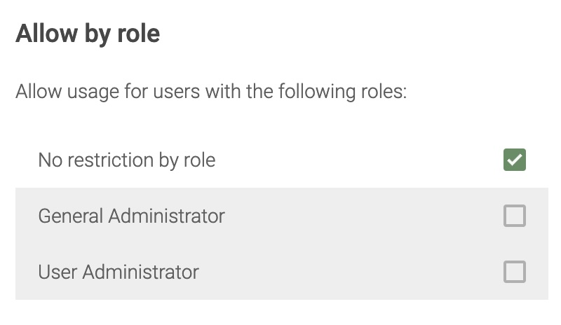

<a href="https://developers.exlibrisgroup.com/appcenter/copy-user-roles/">%5D.user_count&style=flat&label=Cloud%20App%20Activations)</a>
<a href="https://developers.exlibrisgroup.com/appcenter/copy-user-roles/">%5D.version&label=Deployed%20Version&color=green)</a>

# Copy User Roles

An [ExLibris Alma CloudApp](https://developers.exlibrisgroup.com/cloudapps/), which allows to copy user roles from one user to another and also to compare the applied roles of two users.

 
 

## How to use
In order to use the CloudApp, one of the following roles is needed:
* 'User Manager'
* 'User Administrator'
* 'Gerneral System Administrator'

To copy roles from one user to another perform the following steps:

1. Install the 'Copy User Roles' CloudApp (see: [ExLibris documentation on using CloudApps](https://knowledge.exlibrisgroup.com/Alma/Product_Documentation/010Alma_Online_Help_(English)/050Administration/050Configuring_General_Alma_Functions/Configuring_Cloud_Apps#Using_Cloud_Apps))
2. Open the user record in Alma which is to receive new roles
3. Open the 'Copy User Roles' CloudApp
4. The current user record is selected as target user
5. In the CloudApp, search for the user from whom the roles are to be copied
6. Select the user form the list
7. Click the 'Copy user roles' button

## Configuration
The app some institution-wide configuration options, configuration can be set by a user with any of the 'administrator' roles, i.e. 'General System Administrator' or 'Catalog Administrator' (see [ExLibris Documentation](https://developers.exlibrisgroup.com/cloudapps/docs/api/configuration-service/)).

To open the configuration, click the 'three dots menu' an then the configuration icon:

   

### Restrict/manage access
There is a possibility to manage the access to the CloudApp. If no configuration regarding access control is made, no additional restrictions will apply.

**General note**

The following should be noted: The access management in the app only prevents or allows access to the user interface. Access to the API can only be restricted by ExLibris. According to ExLibris, only interfaces to which the logged-in user has access can be used via CloudApp:
> The user must have permissions to perform the action implemented by the API, and any history actions are logged under the user's identity. If the Cloud App attempts to call an API which performs an action for which the logged-in user does not have the proper role, Alma will return a 401 Unauthorized to the Cloud App.

See [ExLibrs documentation](https://developers.exlibrisgroup.com/cloudapps/docs/api/rest-service/)

**Allow by user**

If a user is added to the list of allowed users, access is granted regardless of the users roles.

* To add a user, search for the user in the according search field, and click on the user you want to add
* To remove a user select the user in the list and click the 'trash bin' icon
* After any configuration change, click the 'save' button to save the settings

   

**Allow by role**

To use the app, the role of 'User Manager', 'User Administrator' or 'Gerneral System Administrator' is needed. However, this configuration allows to further restrict to a smaller set of allowed roles. Please note, that as soon as a user is added to the list of allowed users it is not possible to restrict access by role.

   

## Select which roles should be copied

By default all roles assinged to the source user are copied to the target user.

   

If only some roles should be copied, there is the possibilty to select a custom set of roles:

   

Please note, that the slection has no effect when using the 'Compare' function.

## Copying roles from users with invalid roles
* When selecting the source user the roles will be validated, if not all roles are valid there will be a dialog with the error message from Alma, which should help to find the role which is not correctly configured
* The dialog offers the possibilty to proceed anyway: in this case, the valid roles will be copied and the invalid roles will be skipped.
* The copy process with invalid roles **takes significantly longer** than with only valid roles
* After copying, a short summary about the valid and invalid roles is displayed

   

## Comparing roles of two users
* Especially after copying from users with invalid roles, it can be helpful to compare the roles of the two users
* It seems to be possible, that a user has duplicate roles. The copy process reduces the duplicates, which results sometimes in different role numbers between the source user and the target user after copying. This can be verified by comparing the two users

   

### Development
[Notes on CloudApp development](doc/development.md)
